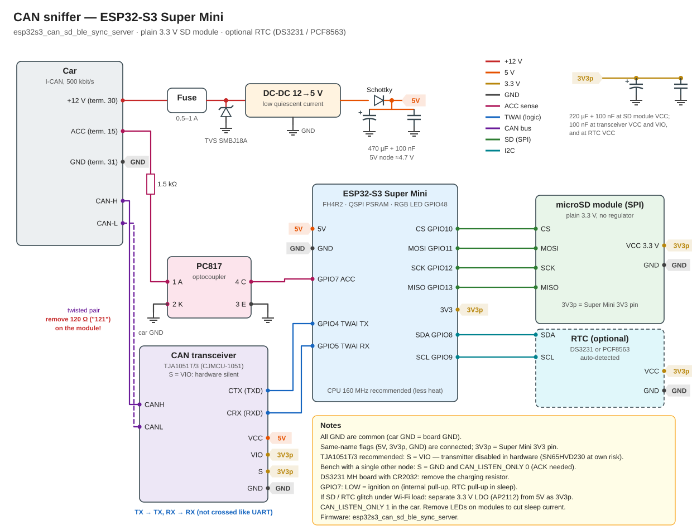

# CAN-сниффер на ESP32 + камера приборки

[English version](README.md)

> ⚠️ **Прочтите до подключения к машине.** На Audi A4 B9 (MLB-Evo) **на шине CAN-Infotainment сидит и селектор АКПП (E313)** — проверено по схеме; на других моделях платформы, скорее всего, так же — проверьте по схеме своей машины. При разработке неисправный трансивер (SN65HVD230) на этой шине «отрезал» селектор от коробки передач — в том числе на ходу: см. [Безопасность](#безопасность). Рекомендуется **TJA1051T/3 с выводом S, соединённым с VIO**; SN65HVD230 — на свой страх и риск. С любым чипом проверяйте сам модуль (см. «Безопасность»).

Пара независимых устройств для реверс-инжиниринга CAN-шины автомобиля:

- **CAN-сниффер** (ESP32-S3) пассивно пишет все кадры CAN на SD-карту с реальным временем суток, засыпает при выключенном зажигании и поднимает Wi-Fi-портал: скачивание логов, установка часов, выбор скорости шины, обновление прошивки.
- **Камера приборки** (AI-Thinker ESP32-CAM) фотографирует щиток приборов каждые 500 мс. Её часы синхронизируются со сниффером по BLE, поэтому каждый кадр можно сопоставить с CAN-трафиком, записанным в тот же момент.

Изначально сделано для Audi A4 B9 (MLB-Evo, I-CAN на 500 кбит/с), но сниффер работает на любой CAN-шине от 20 кбит/с до 1 Мбит/с.

---

## Структура репозитория

Arduino IDE требует, чтобы каждый скетч лежал в папке с тем же именем:

```
esp32s3_wroom_can_sd_ble_sync_server/
    esp32s3_wroom_can_sd_ble_sync_server.ino    — CAN-сниффер, плата ESP32-S3-WROOM-1 CAM
    src/lzma/                                   — кодер LZMA (LZMA SDK, public domain)
esp32s3_can_sd_ble_sync_server/
    esp32s3_can_sd_ble_sync_server.ino          — CAN-сниффер, ESP32-S3 Super Mini
    src/lzma/                                   — кодер LZMA (LZMA SDK, public domain)
esp32s3_can_ble_gateway/
    esp32s3_can_ble_gateway.ino                 — шлюз CAN → BLE только для HUD (Super Mini, без SD и часов)
esp32s3_wroom_can_ble_replay/
    esp32s3_wroom_can_ble_replay.ino            — стендовое проигрывание логов для HUD по BLE (ESP32-S3-WROOM-1 CAM)
    src/lzma/                                   — декодер LZMA (LZMA SDK, public domain)
esp32cam_aithinker_can_ble_replay/
    esp32cam_aithinker_can_ble_replay.ino       — тот же стендовый проигрыватель на свободной AI-Thinker ESP32-CAM (штатный microSD, камера не нужна)
    src/lzma/                                   — LZMA-декодер (LZMA SDK, public domain)
esp32cam_aithinker_video_ble_sync_client/
    esp32cam_aithinker_video_ble_sync_client.ino — камера, режим записи
esp32cam_aithinker_aiming_stream/
    esp32cam_aithinker_aiming_stream.ino         — камера, режим юстировки (видеопоток)
esp32s3cam_ov5640_video_ble_sync_client/
    esp32s3cam_ov5640_video_ble_sync_client.ino  — камера ESP32-S3 + OV5640, режим записи
esp32s3cam_ov5640_aiming_stream/
    esp32s3cam_ov5640_aiming_stream.ino          — камера ESP32-S3 + OV5640, режим юстировки
docs/
    sniffer_supermini.svg, sniffer_supermini_sd_ams1117.svg, sniffer_wroom.svg,
    gateway_supermini.svg, camera_aithinker.svg,
    camera_s3_ov5640.svg                         — схемы подключения
tools/
    can_time_decode.py                           — дата/время и пробег из CAN-логов
    log_unpack.py                                — распаковка логов .txt.lzma / .txt.gz (и оборванных), склейка папки
README.md
README_ru.md
.gitignore                                       — не пускает secrets.h и fonts/ в git
```

В каждой папке сниффера, шлюза и проигрывателя лежит также `secrets.example.h` (шаблон секретов; см. «Секреты» ниже).

---

## Схемы подключения

| | |
|---|---|
| CAN-сниффер, ESP32-S3-WROOM-1 CAM | [docs/sniffer_wroom.svg](docs/sniffer_wroom.svg) |
| CAN-сниффер, ESP32-S3 Super Mini, простой SD-модуль на 3.3 В (основная) | [docs/sniffer_supermini.svg](docs/sniffer_supermini.svg) |
| CAN-сниффер, ESP32-S3 Super Mini, SD-модуль с AMS1117, питающим периферию | [docs/sniffer_supermini_sd_ams1117.svg](docs/sniffer_supermini_sd_ams1117.svg) |
| Шлюз CAN → BLE для HUD, ESP32-S3 Super Mini | [docs/gateway_supermini.svg](docs/gateway_supermini.svg) |
| Камера, AI-Thinker ESP32-CAM | [docs/camera_aithinker.svg](docs/camera_aithinker.svg) |
| Камера, ESP32-S3-WROOM-1 CAM + OV5640 | [docs/camera_s3_ov5640.svg](docs/camera_s3_ov5640.svg) |

Подписи на схемах — на английском, общие для обоих README.



---

## 1. CAN-сниффер

### Железо

Два скетча с одинаковой логикой, порталом, форматом логов и BLE, различаются только частями, зависящими от платы:

| | **`esp32s3_wroom_can_sd_ble_sync_server`** — ESP32-S3-WROOM-1 CAM (рекомендуется) | **`esp32s3_can_sd_ble_sync_server`** — ESP32-S3 Super Mini |
|---|---|---|
| Модуль | N16R8: 16 МБ flash, 8 МБ **OPI** PSRAM | FH4R2: 4 МБ flash, 2 МБ **QSPI** PSRAM |
| SD-карта | Слот на плате, SD_MMC 1 бит | Внешний модуль по SPI |
| Стабилизатор 3.3 В | AMS1117 (нужно ≥ 4.4 В на входе) | Маленький LDO на плате — на пределе с SD и Wi-Fi |

Общие компоненты:

| Компонент | Примечание |
|---|---|
| CAN-трансивер | **Рекомендуется TJA1051T/3** (например, плата CJMCU-1051 с оригинальным чипом): VCC 5 В, VIO 3.3 В, **S на VIO** — аппаратный silent mode. SN65HVD230 работает, но на свой страх и риск (см. «Безопасность»); **это чип на 3.3 В: VCC только от 3.3 В, не от 5 В** |
| Часы (необязательно) | DS3231 или PCF8563, определяются автоматически. Без них время берётся с шины CAN (см. «Время»). Плата DS3231 MH: **цепь заряда нужно убрать**, если стоит CR2032 |
| Лишние светодиоды | **Уберите их** на всех платах и модулях (индикаторы питания на модулях SD, часов, трансивера, понижайки, а также на самих ESP32): они горят постоянно, в том числе во сне, и дают основную часть тока покоя на стоянке. Светодиод состояния (WS2812) управляется прошивкой и гасится перед сном |
| Оптрон (PC817 или аналог) | Детект ACC (зажигания), резистор 1.2–1.5 кОм со стороны 12 В |
| Понижающий DC-DC 12 → 5 В | Важен малый ток покоя: он работает от постоянных 12 В. Для платы WROOM выставьте 5.2–5.3 В, если последовательно стоит диод Шоттки |

### Подключение

| Сигнал | WROOM CAM | Super Mini |
|---|---|---|
| TWAI TX → **CTX** трансивера (D / TXD) | GPIO41 | GPIO4 |
| TWAI RX ← **CRX** трансивера (R / RXD) | GPIO42 | GPIO5 |
| SD | слот на плате (CLK 39, CMD 38, D0 40) | GPIO10 CS / 11 MOSI / 12 SCK / 13 MISO |
| Часы SDA / SCL (необязательно) | GPIO21 / GPIO47 | GPIO8 / GPIO9 |
| ACC (выход оптрона, LOW = зажигание вкл.) | GPIO14 | GPIO7 |

На плате WROOM CAM пины 4–18 разведены под разъём камеры, поэтому сниффер использует свободные. Светодиод IO2 на плате держится погашенным; GPIO2 для I2C не годится.

> **TX к TX, RX к RX.** В отличие от UART, линии здесь *не* перекрещиваются: названия и у ESP32, и у трансивера даны с одной точки зрения — к шине и от шины.

**Трансивер — рекомендуется TJA1051T/3.** VCC = 5 В, VIO = 3.3 В (задаёт уровни логики для ESP32), **S = VIO в машине**: silent mode, передатчик отключён физически, и трансивер не может занять шину ни при загрузке, перезагрузке, сне или сбое ESP32. Трансиверы без такого вывода (например, SN65HVD230) работают, но, пока вывод TX никем не управляется, могут удерживать шину в доминантном состоянии — используйте их на свой страх и риск. При S = VIO оставляйте `CAN_LISTEN_ONLY 1`: в режиме NORMAL контроллер не увидит своих ACK и уйдёт в ошибки. Стенд с единственным другим узлом: S = GND и `CAN_LISTEN_ONLY 0`.

**Если ставите SN65HVD230 (на свой страх и риск), питание другое:** это **чип на 3.3 В — VCC к шине 3.3 В (3V3p), ни в коем случае не к 5 В** (5 В его повредят). Выводов VIO и S у него нет; Rs → GND (высокоскоростной режим). CTX/CRX подключаются так же (D = CTX, R = CRX). На схемах показано подключение TJA1051T/3; для SN65HVD230 провод 5 В к трансиверу не подключайте, а VCC питайте от 3V3p.

До подключения к ESP32 проверьте, что на CRX в покое около 3.3 В, а не 5 В.

**Терминатор:** в машине шина уже терминирована. Между CANH и CANL на сниффере должно быть несколько десятков кОм (входное сопротивление трансивера). Если около 120 Ом — снимите резистор на плате трансивера.

### Настройки Arduino IDE

Ядро **Arduino-ESP32 3.x**, плата **ESP32S3 Dev Module**, USB Mode **Hardware CDC and JTAG**, USB CDC On Boot **Enabled**, и дальше:

| | WROOM CAM | Super Mini |
|---|---|---|
| Flash Size | 16MB | 4MB |
| PSRAM | **OPI PSRAM** | **QSPI PSRAM** |
| Partition Scheme | 16M Flash (3MB APP/9.9MB FATFS) | Minimal SPIFFS (1.9MB APP with OTA/190KB SPIFFS) |

При неверном типе PSRAM будет ошибка `PSRAM chip is not connected`. В обеих схемах разделов два слота приложения для OTA. Схему разделов меняет только прошивка по USB: сделайте это один раз, дальше обновляйтесь по Wi-Fi. На плате WROOM логика «не спать, пока подключён комп» работает через родной порт **USB**, а не через **COM**.

Библиотеки: **RTClib** (Adafruit), **NimBLE-Arduino 2.x**. Остальное входит в ядро. Кодер LZMA лежит в самом скетче, в `src/lzma/`, и собирается автоматически — ставить ничего не нужно.

### Секреты

Пароли и код доступа BLE хранятся в `secrets.h` рядом со скетчем, **а не** в основном файле — поэтому они не попадают в публикацию. В репозитории лежит только шаблон `secrets.example.h`; `secrets.h` внесён в `.gitignore`.

1. Скопируйте `secrets.example.h` в `secrets.h` (в архиве такой файл уже есть, со значениями-заглушками).
2. Задайте свои значения: `BLE_PASSKEY` (шесть цифр без ведущих нулей), `AP_PASSWORD`, `OTA_PASSWORD`, `OTA_WEB_USER` (шлюзу и проигрывателю нужен только `BLE_PASSKEY`).
3. Если `secrets.h` нет, сборка остановится с понятной ошибкой `#error`.

### Параметры сборки (`#define` в начале скетча)

| Define | По умолчанию | Назначение |
|---|---|---|
| `FW_VERSION` | `"2.8.2"` (снифферы) / `"1.2.0"` (шлюз) / `"1.1.0"` (проигрыватель) | Версия прошивки (MAJOR — несовместимые форматы, MINOR — новые функции, PATCH — исправления) |
| `CAN_LISTEN_ONLY` | `1` | 1 — машина (не передаёт ничего, даже ACK), 0 — стенд (нужно, если на стенде всего один другой узел) |
| `CAN_BITRATE_DEFAULT` | `500000` | Скорость, если в NVS ничего не сохранено |
| `CAN_TIME_SYNC` | `2` | Время из кадра CAN 0x6B2: 0 — выкл, 1 — только пока время неизвестно, 2 — ещё и подводить часы при расхождении больше `CAN_TIME_MAX_DIFF_S` (5 с) |
| `CAN_TIME_TZ_HOURS` | `0` | Сдвиг, если машина шлёт UTC |
| `CAN_TIME_MAX_JUMP_S` | `0` | Защита от сбитых часов машины: 0 — доверять машине полностью; >0 — если у сниффера уже есть достоверное время, а машина расходится больше чем на столько секунд, время машины не берётся. Время машины раньше даты сборки прошивки отбрасывается всегда |
| `CAN_TIME_WAIT_MS` | `4500` | Сколько ждать кадр времени перед открытием первого файла лога (кадры пока копятся в памяти) |
| `CAN_TIME_CONFIRM_FRAMES` | `3` | Время машины принимается только после стольких кадров 0x6B2 подряд, согласованных между собой (±2 с); значения вне интервала и несуществующие даты сбрасывают серию — защита от глюков GPS |
| `LOG_MAX_BYTES` | `4 МБ` | Размер для ротации лога — файла на карте, то есть сжатого (новый файл также начинается при каждом старте) |
| `LOG_COMPRESS` | `2` | Сжатие «на лету»: 2 — LZMA (`.txt.lzma`, ~8 раз, ~1 МБ PSRAM), 1 — gzip (`.txt.gz`, ~3.5 раза, ~130 КБ), 0 — простой `.txt` |
| `LOG_LZMA_DICT` | `64 КБ` | Словарь LZMA; 64 КБ — оптимум для CAN-логов (32 КБ ≈ 7.7 раза) |
| `LOG_GZ_DEPTH` | `4` | Только gzip — глубина поиска повторов: 1 — минимум нагрузки на процессор, 4 — лучше сжатие почти даром |
| `LOG_GZ_SYNC_MS` | `1000` | Только gzip — раз в столько мс сжатые данные сбрасываются на карту; после сбоя файл распаковывается до этого места |
| `WIFI_AP_HIDDEN` | `0` | 1 — скрытая точка доступа (SSID не транслируется) |
| `WIFI_ACTIVE_MINUTES` | `5` | Точка доступа Wi-Fi, портал и OTA через espota работают столько минут после включения зажигания, потом Wi-Fi выключается до следующего включения (меньше нагрев и потребление). Пока порталом пользуются, не выключается. 0 — работает всё время |
| `LOG_PAUSE_WHILE_PORTAL` / `LOG_PORTAL_HOLD_MS` | `1` / `60 с` | Пока портал в работе (клиент на точке доступа и запросы за последние `LOG_PORTAL_HOLD_MS`), запись лога на SD приостанавливается: файл закрывается (маркер `PAUSE (portal)`), кадры не сохраняются, а когда портал свободен — запись идёт в новый файл (`CONTINUED`). 0 — не останавливать |
| `AP_CHANNEL` | `0` | 0 — при старте выбрать самый тихий из каналов 1 / 6 / 11 (сканирование 2–3 с; соседние сети учитываются по мощности сигнала в мВт и по перекрытию каналов, так что одна сеть на −45 дБм весит больше многих на −75 дБм); 1–13 — фиксированный канал. Выбранный канал и помеха по каналам видны в Serial и внизу главной страницы портала |
| `WIFI_TX_POWER` | `WIFI_POWER_13dBm` (WROOM) / `WIFI_POWER_8_5dBm` (Super Mini) | Мощность передатчика Wi-Fi: меньше — ниже броски тока, но меньше дальность и скорость портала |
| `AP_SSID` | `S3-CAN-Sniffer-Setup` | Имя точки доступа портала |
| `AP_PASSWORD` *(secrets.h)* | `canlogger123` | Пароль точки доступа портала |
| `OTA_PASSWORD` / `OTA_WEB_USER` *(secrets.h)* | `changeme123` / `admin` | **Смените перед использованием.** Общие для `/update` и espota |
| `BLE_PASSKEY` *(secrets.h)* | `0` | Код доступа BLE: шесть цифр без ведущих нулей; **0 — защита BLE выключена** (открытый доступ). См. «Защита BLE» |
| `USB_HOST_KEEPS_AWAKE` | `1` | Не спать, пока подключён USB-хост (комп). Поставьте 0, если сниффер питается от USB магнитолы |
| `USB_LOST_GRACE_MS` | `5000` | Сколько USB-хост должен отсутствовать, прежде чем уснуть |
| `WEB_HOLD_MS` | `300000` | Сколько сниффер не спит после последнего запроса к порталу |

### Светодиод состояния

RGB-светодиод на плате (WS2812, GPIO48) вспыхивает раз в секунду, пока сниффер не спит. Сначала вспышка состояния, по приоритету: **красный** — ошибка, мешающая записи (SD не смонтирована, не открывается файл лога, не запустился приём CAN); **жёлтый** — частичная работоспособность (время не установлено и лог идёт в `/no-rtc`, либо часы сообщают об остановке генератора); **синий** — к точке доступа подключён клиент (работает портал); **зелёный** — всё в порядке. Следом короткая **белая** вспышка, если за последнюю секунду были кадры CAN. Едем: зелёный + белый; шина молчит: только зелёный. Перед сном и перезагрузкой светодиод гасится. Параметры: `RGB_LED_ENABLE`, `RGB_LED_BRIGHTNESS`, `RGB_LED_FLASH_MS`, `RGB_LED_PERIOD_MS`, `RGB_LED_GAP_MS`.

### Веб-портал

Подключитесь к точке доступа и откройте `http://192.168.4.1`.

- `/` — дата и время с указанием источника и найденных часов, кнопка «Время телефона», скорость CAN, версия прошивки
- `/errors` — журнал ошибок прямо в браузере: свежие записи сверху (последние 300 строк), скачивание `errors.log` / `errors.old.log`, очистка журнала
- `/logs` — папки с логами по датам, в свёрнутом виде; «+» раскрывает список файлов папки (число файлов и общий размер видны сразу); скачивание одного файла, нескольких папок одним TAR-архивом (файл, который сейчас пишется, перед скачиванием автоматически закрывается и попадает в архив целиком, а следующий, открытый сразу после этого, в архив не включается) или рекурсивное удаление выбранных папок (с подтверждением; папка, в которую сейчас идёт запись, защищена)
- Если SD-карта не монтируется, на главной странице появляется кнопка **«Форматировать карту в FAT32»** (под тем же паролем, что `/update`). Карты от 64 ГБ обычно продаются в exFAT, а ядро Arduino-ESP32 его не поддерживает. Смонтированная карта никогда не форматируется — для очистки используйте удаление папок на `/logs`. Большую карту можно отформатировать в FAT32 и на компьютере утилитами guiformat или Rufus (штатное форматирование Windows не делает FAT32 больше 32 ГБ).
- `/update` — прошивка из браузера (Basic Auth: `OTA_WEB_USER` / `OTA_PASSWORD`)

**Язык:** RU/EN. Красная кнопка вверху каждой страницы показывает *другой* язык; выбор хранится в NVS (`ui/lang`), по умолчанию русский, переключение мгновенное. Вывод в Serial всегда на русском.

**Скорость CAN:** 1000, 800, 500, 250, 125, 100, 83.3, 50, 33.3, 25, 20 кбит/с. Хранится в NVS (`sniffer/can_bps`), применяется автоматическим перезапуском. Для 83.3 и 33.3 кбит/с тайминги заданы вручную; 33.3 кбит/с (GMLAN Single-Wire) требует однопроводного трансивера.

### Обновление прошивки

**Из браузера (можно с телефона):** в Arduino IDE выберите *Sketch → Export Compiled Binary*, возьмите `<скетч>.ino.bin` (не `merged` и не `bootloader`) и залейте на странице `/update`. До записи страница проверяет, что файл — образ приложения для ESP32-S3; если заливка сорвалась или образ не прошёл проверку, остаётся старая прошивка.

**Через espota** (Arduino IDE не нужна, `espota.exe` — самостоятельный файл из папки `tools` ядра):

```
espota.exe -i 192.168.4.1 -p 3232 -a <OTA_PASSWORD> -f firmware.bin -P 3233 -d -r
```

ESP32 сам подключается *обратно* к компьютеру, поэтому порт 3233 нужно разрешить в файрволе.

### Питание и сон

- Зажигание выключено → лог закрывается штатно → deep sleep с пробуждением по пину ACC. Подтяжка держится в RTC-домене, иначе висящий в воздухе пин вызывает бесконечные ложные пробуждения.
- Проснулся, а зажигание уже выключено → сразу обратно в сон, без полной инициализации.
- Сниффер не спит, пока: заливается прошивка, подключён USB-хост или идёт работа с порталом (телефон, который просто сам подключился к точке доступа, сон не держит).
- Портал поднимается только при включённом зажигании; выключить его уже во время работы с порталом можно.

### Время

Время с годом меньше `TIME_MIN_YEAR` (2026) считается ошибкой и не принимается ни из какого источника (часы, CAN, портал): лог идёт в `/no-rtc`, светодиод жёлтый.

Внешние часы необязательны. При старте сниффер берёт время по порядку:

1. **DS3231 или PCF8563** на I2C, если есть (определяются по адресам 0x68 / 0x51). Если чип сообщает, что генератор останавливался (OSF у DS3231, VL у PCF8563), но время правдоподобное, оно используется с пометкой на портале.
2. После пробуждения из глубокого сна — **системные часы ESP32**, которые идут и во сне.
3. **Кадр CAN 0x6B2** (Diagnose_01: дата, время и пробег раз в секунду). Кадры, пришедшие до него, копятся в памяти, поэтому первый файл лога сразу попадает в папку с правильной датой.
4. **Портал**: вручную или кнопкой «Время телефона».

При `CAN_TIME_SYNC 2` главные — часы машины. После отключения аккумулятора они сбиваются: выставьте их (или включите синхронизацию по GPS в MMI) либо переключитесь на `1` / `0`. Время, установленное на портале или взятое из CAN, записывается и во внешние часы, если они есть. В маркере загрузки в логе указаны источник времени и тип часов.

`tools/can_time_decode.py` расшифровывает 0x6B2 из готовых логов и переводит `millis` сниффера (и имена кадров камеры) в реальное время.

### Диагностика

**Строка `[STAT]` в Serial** раз в минуту, пока на шине есть трафик:

```
[STAT] кадров 1650/с, лог 64.2 КБ/с, на карту 7.7 КБ/с (сжатие 8.3x), буфер кодера макс 9%, очередь CAN макс 2%, потеряно 0 (всего 0)
```

Кадров в секунду, скорость текста лога, скорость записи сжатых данных на карту, максимальное заполнение входного буфера LZMA и очереди кадров CAN за минуту и потерянные кадры. Если очередь подбирается к 100 % или появляются потери, кодер не успевает — поднимите частоту процессора до 240 МГц или переключитесь на `LOG_COMPRESS 1`.

**`/errors.log` в корне SD-карты** — ошибки и важные события с датой и временем, версией прошивки и временем работы: перезагрузки по сбою (`PANIC`, `TASK_WDT`, `BROWNOUT`…), потери кадров CAN (сводкой раз в минуту), ошибки файла лога и кодера, сбой запуска TWAI, флаг остановки часов, отклонённое время машины, ошибки прошивки через портал. События до монтирования карты копятся в памяти и записываются после. Больше 256 КБ — файл переносится в `errors.old.log`. На главной странице портала видны счётчики принятых и потерянных кадров; сам журнал можно посмотреть на странице `/errors` (свежие записи сверху), там же скачать или очистить. В маркере закрытия каждого файла лога тоже пишется `dropped=N`.

### Формат лога

Файлы: `/YYYY-MM-DD/can_log_NNNN.txt.lzma` (при `LOG_COMPRESS 1` — `.txt.gz`, при `0` — `.txt`). Файлы создаются только при появлении реальных кадров CAN: нет трафика на шине — нет файла. Новый файл начинается при каждом старте (на первом кадре) и когда текущий дорастает до `LOG_MAX_BYTES` (с LZMA файл на 4 МБ вмещает ~33 МБ текста — около 8 минут плотного трафика I-CAN). После полуночи следующий файл уходит в папку новой даты. Если DS3231 не найден или его время недостоверно, лог пишется в `/no-rtc/`, пока время не установят на портале (камера в этом случае пишет в `/no-rtc/frames/`). DS3231 читается только один раз при старте, дальше используются системные часы ESP32. Файлы одной поездки можно просто склеить по порядку имён.

**LZMA (по умолчанию).** Кодер из LZMA SDK работает в отдельной задаче: задача записи на SD передаёт ему строки лога через потоковый буфер, а кодер пишет сжатый поток в файл. Формат — стандартный `.lzma`: открывается 7-Zip, FAR (ArcLite), `xz --format=lzma -d` или модулем `lzma` в Python. Сжатые данные уходят на карту каждые ~4 КБ. У файла, который не закрылся штатно (сбой, пропало питание), нет маркера конца — `tools/log_unpack.py` распаковывает его до места обрыва без ошибок и умеет склеить папку в один текстовый файл для других скриптов (например, `bap_nav_decode.py`).

**gzip (`LOG_COMPRESS 1`).** Обычный gzip от небольшого встроенного компрессора (LZ77 + фиксированные коды Хаффмана): памяти меньше, но сжатие ~3.5 раза вместо ~8. Данные сбрасываются на карту каждые `LOG_GZ_SYNC_MS`.

Один кадр — одна строка (внутри архива):

```
<millis> <S|X> <ID hex> [R]<DLC> <байты hex>

123456 S 30B 8 00 11 22 33 44 55 66 77
123470 X 17333210 8 80 0A 4C 92 00 00 01 F4
```

`S` — 11-битный ID (3 hex-цифры), `X` — 29-битный (8 hex-цифр), `R` перед DLC — remote-кадр. Строки, начинающиеся с `#`, — служебные маркеры, парсер их пропускает:

```
# 812 ===== BOOT / SYNC MARK ===== fw=1.2.0 build="Sep 25 2026 22:53:51" reset=DEEPSLEEP can_bps=500000
# 931204 ===== ACC OFF / SHUTDOWN =====
```

Причины закрытия: `ROTATE (download)`, `ACC OFF / SHUTDOWN`, `OTA REBOOT`, `CONFIG REBOOT` (с `dropped=N` — потеряно кадров с момента запуска), `ROTATE`; файл после ротации начинается строкой `CONTINUED from can_log_NNNN.txt.lzma` с версией прошивки и скоростью шины, так что каждый файл самодостаточен. В маркере загрузки записаны версия прошивки, причина сброса (`BROWNOUT`, `PANIC`, `TASK_WDT` и т. д. помогают разобраться с самопроизвольными перезагрузками) и скорость шины.

### BLE

Имя устройства `S3-CAN-Sniffer`, сервис `A1B2C3D4-0001-41A2-9E3B-000000000001`:

| Окончание UUID | Свойства | Назначение |
|---|---|---|
| `…0002` | NOTIFY | Синхронизация времени `{millis, unixEpoch}`, отправляется из `onSubscribe()` |
| `…0004` | WRITE | Выбор CAN ID для наблюдения (uint32) |
| `…0005` | NOTIFY | Сырые байты наблюдаемого ID |
| `…0007` | WRITE, READ | Список правил фильтра в стиле ACL для потока сырых кадров (бинарный, до 32 правил) |
| `…0008` | NOTIFY | Сырые кадры CAN, прошедшие фильтр, пачками в уведомлениях |

HUD присылает свой список после каждого подключения и сам расшифровывает кадры. Протокол: [docs/BLE_ACL_protocol_ru.md](docs/BLE_ACL_protocol_ru.md).

#### Защита BLE

Включается ненулевым `BLE_PASSKEY` в `secrets.h` (снифферы, шлюз, проигрыватель). Подробности для разработчиков клиентов: [docs/BLE_pairing_protocol_ru.md](docs/BLE_pairing_protocol_ru.md).

- Сопряжение по коду из шести цифр (LE Secure Connections, MITM, запоминание ключей). Устройство «показывает» код, клиент «вводит» его — программно, без участия человека; одна и та же константа прописывается в устройстве и в клиенте.
- **Один сопряжённый клиент на устройство.** Когда клиент сопряжён, новые сопряжения не принимаются, а второе соединение сбрасывается. Сброс: **удержание BOOT 5 с на работающем устройстве** — фиолетовое мигание во время отсчёта, белое по окончании (не удерживайте BOOT при включении питания: плата уйдёт в режим загрузчика).
- Соединение без сопряжения за 15 с отключается; 5 неудач подряд блокируют сопряжение на 60 с. Подписки и запись ACL принимаются только по зашифрованному каналу.
- Шестизначный код защищает от случайных подключений и любопытных, но не от целенаправленного взлома. При `BLE_PASSKEY 0` доступ открыт, как в прежних версиях.
- Скетчи камер пока не обновлены: они работают с устройством, только пока его `BLE_PASSKEY` равен 0.

Плюс стандартный Device Information Service (`0x180A`) с версией прошивки и датой сборки.

---

## Шлюз CAN → BLE для HUD — `esp32s3_can_ble_gateway`

Упрощённый сниффер для постоянной установки вместе с HUD: ESP32-S3 Super Mini и CAN-трансивер с питанием от линии зажигания (ACC) — без SD-карты, часов, Wi-Fi, сна и потребления на стоянке. Он только принимает шину и отдаёт по BLE кадры, прошедшие фильтр ACL от HUD. Для HUD он неотличим от сниффера: то же имя BLE (`S3-CAN-Sniffer`), те же UUID и протокол ([docs/BLE_ACL_protocol_ru.md](docs/BLE_ACL_protocol_ru.md)). Характеристика синхронизации времени `…0002` оставлена для камеры; дата и время берутся из кадра CAN 0x6B2. Светодиод: синий — ждём HUD, зелёный (+ белый, пока уходят кадры) — идёт поток, красный — не запустился CAN. Параметры: `CAN_BITRATE`, `CAN_LISTEN_ONLY`. Трансивер — TJA1051T/3 с S = VIO, как у сниффера. Схема: [docs/gateway_supermini.svg](docs/gateway_supermini.svg). Прошивка — по USB (Wi-Fi и OTA нет). Защита BLE работает как у сниффера (`BLE_PASSKEY` в `secrets.h`, один сопряжённый клиент, удержание BOOT 5 с сбрасывает сопряжения).

## Стендовый проигрыватель для HUD — `esp32s3_wroom_can_ble_replay`

Замена снифферу на столе: плата ESP32-S3-WROOM-1 CAM с тем же именем BLE (`S3-CAN-Sniffer`), теми же UUID и тем же протоколом ACL, но вместо живой шины она проигрывает записанные ранее логи.

1. Скопируйте логи сниффера (`can_log_NNNN.txt.lzma` или `.txt`) в папку `/replay` на microSD — можно целыми папками по датам; файлы проигрываются по порядку имён.
2. Включите плату и подключите HUD.
3. Когда HUD подпишется на `…0008` и запишет свой список в `…0007`, начнётся проигрывание: кадры, прошедшие фильтр, уходят с теми же интервалами, что были в машине. Новый список ACL (или переподключение) — проигрывание с начала.

На границах сессий (маркер `BOOT`) — пауза 1 с, файлы-продолжения идут без паузы. Параметры: `REPLAY_LOOP`, `REPLAY_SPEED`, `REPLAY_SESSION_GAP_MS`. Светодиод: синий — ждём HUD, зелёный (+ белый, пока уходят кадры) — идёт проигрывание, красный — нет SD-карты или файлов. Логи `.gz` пропускаются — сначала распакуйте их `tools/log_unpack.py`. Не включайте проигрыватель одновременно с настоящим сниффером: у них одинаковое имя в BLE. Защита BLE работает как у сниффера; HUD сопрягается с проигрывателем и со шлюзом как с двумя разными устройствами.

Arduino IDE: ESP32S3 Dev Module, Flash 16MB, PSRAM «OPI PSRAM». Библиотека: NimBLE-Arduino 2.x.

---

### Проигрыватель на AI-Thinker ESP32-CAM — `esp32cam_aithinker_can_ble_replay`

Тот же проигрыватель для платы, которая больше не пишет приборку. Поведение, имя BLE, протокол, настройки и сопряжение те же; отличия:

- Плата «AI Thinker ESP32-CAM», **PSRAM: Disabled**; камера не используется. Штатный слот microSD работает как есть (SD_MMC, 1 бит); яркий светодиод-вспышка (GPIO4) не используется: он делит пин с картой.
- Питание 5 В; CAN-трансивера и проводки нет.
- Один красный светодиод (GPIO33), состояние по числу вспышек в секунду: 1 — ждём HUD, 2 — идёт проигрывание, 3 — проигрывание и кадры уходят по BLE, частое мигание — нет SD или нет файлов.
- Сброс сопряжений: кнопка между **IO0** и GND (кнопка IO0 на программаторе ESP32-CAM-MB), удержать 5 с.
- Прошивка: через ESP32-CAM-MB или USB-UART (на время включения IO0 на GND, затем отпустить).
- В `secrets.h` нужен только `BLE_PASSKEY`, как у S3-проигрывателя.

## 2. Камера приборки (AI-Thinker ESP32-CAM)

### Режим записи — `esp32cam_aithinker_video_ble_sync_client`

- JPEG каждые 500 мс, SVGA (800×600) при наличии PSRAM, без него — VGA
- При старте один раз подключается к `S3-CAN-Sniffer` по BLE и синхронизирует `millis()` и системные часы
- Кадры: `/YYYY-MM-DD/frames/f_<millis>.jpg`, где `<millis>` — на шкале времени **сниффера**. Если за 10 с синхронизироваться не удалось — `/no-sync/frames/`
- SD через `SD_MMC` в **1-битном** режиме (CLK 14, CMD 15, D0 2). GPIO12 сознательно не используется (strapping-пин)
- Белая вспышка (GPIO4) принудительно погашена
- Питание: диод Шоттки + суперконденсатор. `GPIO13` через делитель следит за питанием, точка съёма — **до** диода; при пропадании питания SD закрывается, чип уходит в deep sleep. `POWER_LOST_THRESHOLD` нужно откалибровать на реальном железе

Плата: **AI Thinker ESP32-CAM**, PSRAM включён. Библиотека: **NimBLE-Arduino 2.x**.

### Режим юстировки — `esp32cam_aithinker_aiming_stream`

Отдельный скетч для наведения камеры при установке: точка доступа `ESP32CAM-Aiming`, MJPEG-поток на `/stream`, страница `/` с сеткой по правилу третей и красным крестом по центру.

| Define | По умолчанию | Назначение |
|---|---|---|
| `WIFI_AP_HIDDEN` | `0` | 1 — скрытая точка доступа |
| `AP_PASSWORD` | `""` | Пусто — открытая сеть, иначе WPA2 (не короче 8 символов) |

Язык страницы RU/EN — та же красная кнопка, что у сниффера (NVS `ui/lang`, по умолчанию русский). При нажатии кнопка сначала останавливает поток, потому что веб-сервер обслуживает одного клиента за раз.

Режимы разнесены по разным скетчам, потому что камера + веб-сервер на Wi-Fi + NimBLE вместе не помещаются в IRAM классического ESP32. Чтобы переключиться, прошейте другой скетч; тумблер на GPIO0 переводит плату в режим загрузки без вскрытия корпуса.

### Альтернативная камера: ESP32-S3-WROOM (N16R8) + OV5640

Скетчи `esp32s3cam_ov5640_video_ble_sync_client` и `esp32s3cam_ov5640_aiming_stream` делают то же самое на плате камеры с ESP32-S3 (Freenove ESP32-S3 WROOM CAM и клоны, распиновка камеры как у ESP32-S3-EYE). Используется либо один вариант камеры, либо другой; оба работают с тем же сниффером.

| | AI-Thinker ESP32-CAM | ESP32-S3 CAM + OV5640 |
|---|---|---|
| Разрешение по умолчанию | SVGA 800×600 | HD 1280×720 (`FRAME_SIZE`, до 2560×1920) |
| Пины камеры | XCLK 0, SIOD 26, SIOC 27, … | XCLK 15, SIOD 4, SIOC 5, D0–D7 11/9/8/10/12/18/17/16, VSYNC 6, HREF 7, PCLK 13 |
| SD (SD_MMC, 1 бит) | CLK 14, CMD 15, D0 2 | CLK 39, CMD 38, D0 40 |
| Контроль питания | GPIO13 | GPIO1 (ADC1) |
| Вспышка | GPIO4, принудительно погашена | нет; `STATUS_LED_PIN` — для светодиода платы, если он бликует в стекле приборки |
| Точка доступа юстировки | `ESP32CAM-Aiming` | `ESP32S3CAM-Aiming` |

Распиновка проверена по плате ESP32-S3-WROOM-1 CAM (N16R8, два USB-C); у других клонов она может отличаться. Светодиод IO2 на плате держится погашенным (`STATUS_LED_PIN 2`); красный светодиод питания программно не выключается — заклейте его, если он бликует в стекле приборки.

Другие отличия:
- `CAMERA_GRAB_LATEST`: каждый кадр свежий, а не взятый из очереди, поэтому метка времени в имени файла соответствует моменту съёмки.
- `WARMUP_FRAMES`: первые кадры после старта выбрасываются, пока OV5640 подстраивает экспозицию и баланс белого.
- `CAM_VFLIP` / `CAM_HMIRROR`: модули OV5640 часто стоят «вверх ногами»; выставляйте одинаково в обоих скетчах.

Arduino IDE: **ESP32S3 Dev Module**, Flash Size **16MB**, PSRAM **OPI PSRAM** (у N16R8 память Octal, в отличие от QSPI у сниффера), Partition Scheme **16M Flash (3MB APP/9.9MB FATFS)** или **Huge APP**. USB CDC On Boot: *Enabled* — чтобы видеть Serial на родном порту «USB», *Disabled* — для порта «COM» (UART-мост).

У ESP32-S3 нет проблемы с IRAM, поэтому запись и юстировку позже можно объединить в одну прошивку; пока они разделены, как в варианте для AI-Thinker.

---

## 3. Работа в машине

1. Сначала включите **сниффер** и дождитесь в Serial строки `BLE синхронизация запущена (S3-CAN-Sniffer)`.
2. Включите **камеру** — она сама найдёт сниффер, синхронизируется и начнёт запись.
3. После поездки подключитесь к `S3-CAN-Sniffer-Setup`, откройте `http://192.168.4.1/logs` и скачайте нужные даты одним TAR-архивом.

**Второй экземпляр** (другая машина): переименуйте BLE-имя и `AP_SSID` (например, добавьте `-2`), иначе логи с разных машин легко перепутать.

---

## Безопасность

### Случай: селектор АКПП потерял связь

При разработке сниффер стоял с трансивером SN65HVD230 и был подключён к шине CAN-Infotainment. На MLB-Evo **на этой шине находится селектор АКПП E313** (разъём T10g, выводы 3/4 — CAN-Infotainment Low/High). С подключённым сниффером селектор терял связь с коробкой передач:

- селектор (81): *шина данных, неисправность*, *шина данных, нет сообщения*;
- коробка (02): **U010300 — селектор, нет связи**, зафиксировано на скорости 76 км/ч;
- шлюз (19), раньше: *шина CAN Infotainment, нет связи* вместе с таймаутами BAP.

Сбой проявлялся **и когда сниффер работал (в режиме `LISTEN_ONLY`), и при выключенном зажигании, когда ESP32 спала**, и пропал, когда сниффер отключили. Контроллер в режиме LISTEN_ONLY ничего не передаёт, поэтому причина — на стороне трансивера или в самой врезке.

**Итог.** Врезка, плата ESP32 и прошивка остались прежними, **заменили только модуль трансивера** — плату с SN65HVD230 на плату с TJA1051T/3, — и с тех пор селектор работает нормально. Значит, дефект был в самом модуле SN65HVD230, а не во врезке, проводке или прошивке. Что нашли на этом модуле:

- собственный терминатор 120 Ом (SMD-резистор с маркировкой `121`), плохо припаянный: на столе между CANH и CANL было 36 кОм, потом в машине 118 Ом, то есть третий терминатор на шине (≈40 Ом вместо 60 Ом). Его убрали, **но селектор после этого всё равно уходил в ошибку**, значит, у модуля был ещё как минимум один дефект;
- оставшийся дефект с наибольшей вероятностью — **сам чип SN65HVD230**: на этом модуле линии CANH и CANL идут от выводов чипа прямо на разъём без какой-либо обвязки (единственной деталью на них был терминатор, и его убрали), а замена модуля решила проблему. Чип отдельно, вне платы, не проверяли.

Вывод: устройство, которое только слушает, всё равно может «положить» шину из-за неисправного чипа трансивера, а на этой шине это включает и селектор коробки.

**Когда устанавливаете любое устройство на шину:** подключайте только на стоянке, после каждого изменения стирайте ошибки и читайте их снова, при первой же ошибке селектора или коробки отключайте.

**Правила, которые из этого следуют:**

- **Рекомендуется TJA1051T/3 с выводом S на VIO.** В режиме silent передатчик отключён физически, вход TXD подтянут внутри, есть защита от зависшего доминантного уровня — устройство не может помешать шине, что бы ни происходило с прошивкой и ESP32. Это касается снифферов, шлюза и HUD.
- **SN65HVD230 и другие трансиверы без вывода silent — на свой страх и риск.** В этом случае, скорее всего, вышел из строя сам чип SN65HVD230 (на том модуле на линиях шины, кроме плохо припаянного терминатора, не было никаких деталей). Аппаратной защиты от неуправляемого вывода TX у них нет.
- **Плата низкого качества может попасться с любым чипом.** Какой бы трансивер вы ни ставили, проверяйте сам модуль: пайку, терминатор на плате, происхождение чипа — и дорабатывайте или меняйте его до установки в машину.
- **Почему TJA1051T/3 намного надёжнее:** его выводы CANH/CANL выдерживают ±58 В (у SN65HVD230 — −4…+16 В).
- **Врезайтесь в провода CAN при выключенном зажигании**, а GND устройства подключайте к массе машины рядом с местом врезки.
- **Ставьте оригинальные чипы.** Режим silent защищает от проблем прошивки и ESP32, но не от повреждённого трансивера. На платах с чипами неизвестного происхождения меняйте чип на оригинальный от надёжного поставщика.
- **Физически убирайте терминатор с каждого модуля трансивера** — найдите резистор с маркировкой `121` (часто R2) между CANH и CANL и выпаяйте его. **Не полагайтесь только на замер:** плохо припаянный резистор может на столе показывать обрыв, а в машине начать проводить.
- **Измеряйте сопротивление CANH–CANL у обесточенного устройства до установки и при любых подозрениях:** десятки кОм — норма; около 120 Ом — терминатор, меньше — неисправный чип; в машину такое не подключать.
- **Проверяйте трансивер на столе до установки** — без питания и с питанием, при работающем и спящем устройстве: CANH–GND и CANL–GND не должны «звониться» малым сопротивлением; напряжение CANH–CANL без других узлов — около 0 В.
- **Врезку в провода CAN пропаивайте и закрывайте термоусадкой** — скрутки от вибрации ослабевают.
- **После установки сотрите ошибки, проездите несколько дней и прочитайте их снова** во всех блоках (шлюз 19, коробка 02, селектор 81, приборка 17). Если появилось что-то, связанное с CAN-Infotainment или селектором, — сразу отключите устройство от шины.
- На столе, до установки: на CRX в покое ~3.3 В; S соединён с VIO; между CANH и CANL нет 120 Ом; **во сне устройства напряжение CANH–CANL около 0 В** (≈2 В — шина удерживается в доминантном состоянии).

### Общее

- **В реальной машине рекомендуется TJA1051T/3 с S на VIO**: устройство не может помешать шине, что бы ни делала прошивка.
- **В реальной машине — только `CAN_LISTEN_ONLY 1`.** В режиме NORMAL неверная скорость вызывает кадры ошибок и может нарушить работу блоков машины.
- **Никаких лишних терминаторов.** Между CANH и CANL на сниффере не должно быть ~120 Ом.
- **DS3231 + CR2032:** плата MH заряжает батарейку от VCC. Уберите зарядный резистор (маркировка `201`) или поставьте аккумулятор LIR2032. Заряжаемая CR2032 в нагретом салоне может вздуться или потечь.
- **Питание:** не питайте сниффер от USB магнитолы (она работает как USB-хост и не даст снифферу уснуть). Используйте DC-DC с малым током покоя, предохранитель и TVS-диод на входе.
- **Лишние светодиоды:** выпаяйте индикаторы питания на всех модулях и платах — это главный источник тока покоя на стоянке. На камере они к тому же бликуют в стекле приборки и портят кадры.
- **Антенна:** у Super Mini керамическая антенна прямо на плате; держите её подальше от металла, иначе дальность портала и BLE сильно падает.
- **Задайте свои секреты** (`BLE_PASSKEY`, `AP_PASSWORD`, `OTA_PASSWORD`) в `secrets.h` до установки и никогда не публикуйте `secrets.h`.

---

## Авторство

Сжатие логов использует кодер LZMA из [LZMA SDK](https://github.com/ip7z/7zip) Игоря Павлова (public domain).


Разработано при участии **Claude** (Anthropic): прошивки, утилиты, схемы и документация написаны совместно с ИИ-ассистентом; железо, проверка в машине и технические решения — автора.
